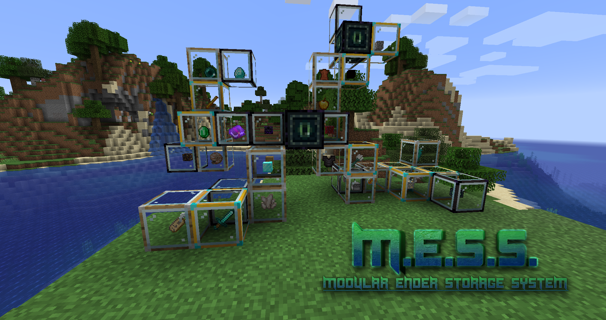
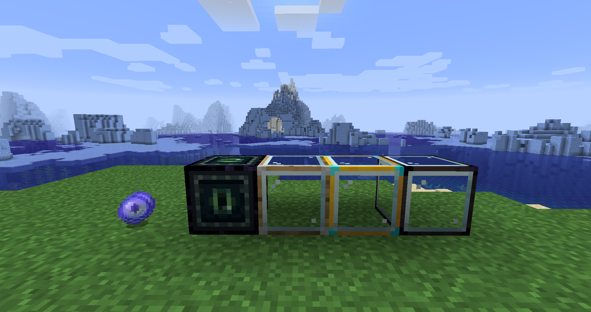
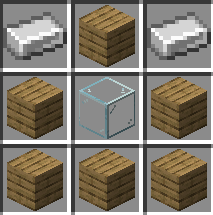
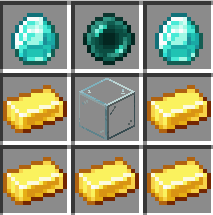
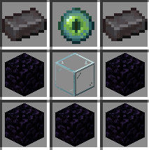
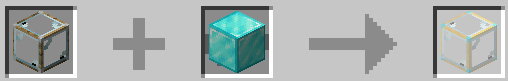
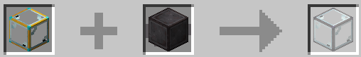
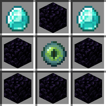
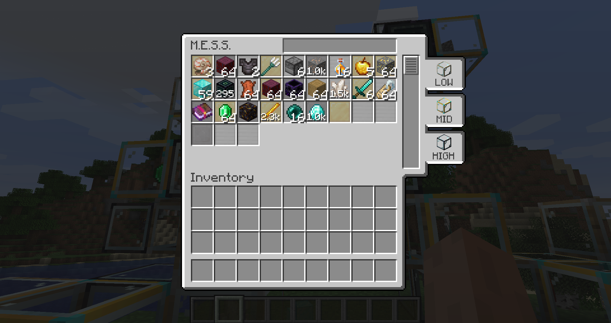

# Too many chests? Don't stress! Make a M.E.S.S!
The **Modular Ender Storage System** mod adds a storage system that loosely fits with the lore of "The End".

It is meant to supplement the vanilla experience without breaking it *too much*.

## Blocks/Items added
The M.E.S.S. mod adds 4 blocks, an item and a GUI, which are explained below.

## Limbs
M.E.S.S. limbs hold items and come in 3 tiers

|        | Low | Mid | High |
|---     | --- | --- | ---- |
|Recipe| | | |
|Storage | 32 stacks | 512 stacks | 4096 stacks | 

Limbs, themselves, do not have a UI and items can be deposited and withdrawn by Right-clicking.

Low and Mid tier limbs can be upgraded in the "Smithing Table".
This process retains the items stored in the limb.

**Upgrade Low -> Mid**

**Upgrade Mid -> High**

## Brain
When limbs are connected to the M.E.S.S. brain, it will become the single point of access to the limbs' inventories.

The brain is crafted like so:

Interacting with the brain will present a GUI with the contents of all connected limbs.

The brain GUI provides multiple functions:
1. You can withdraw and deposit items into the limbs through the brain.
2. You can search through the limbs for specific items.
3. You can toggle which tier limbs to show and items deposited/withdrawn will only go into those tier limbs.

## Ender Link

The Ender Link will serve as your remote connection to the brain on your adventures.

While sneaking, right-clicking an "Eye of Ender" on a brain will create an Ender Link to the brain at that specific location and when used remotely will access the brain's GUI.

If, for some reason you want to revert the Ender Link back into an "Eye of Ender" simply put them in a crafting window.
